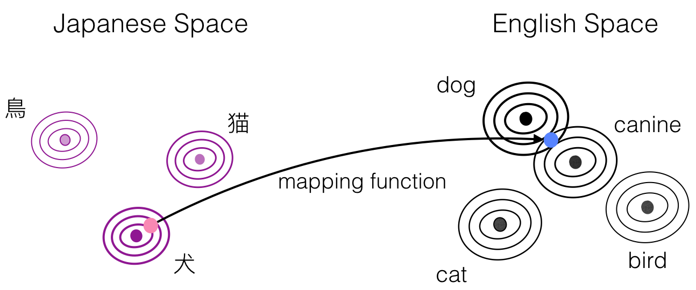

This is the PyTorch implementation for [_Density Matching for Bilingual Word Embedding_](https://arxiv.org/pdf/1904.02343.pdf), 
accepted by NAACL 2019.

<p align="center">
 
</p>

DEMA-BWE expresses the two monolingual embedding spaces as probability densities defined by a Gaussian mixture model, and matches the two densities using normalizing flow. 
The method requires no explicit supervision, and can be learned with only a seed dictionary of words that have identical strings.
This formulation has several intuitively attractive properties, 
particularly with the respect to improving robustness and generalization to mappings between difficult language pairs or word pairs.
We achieved strong results on the bilingual lexicon induction and cross-lingual word similarity.

## Requirements

* Python 3.6
* PyTorch 0.4

## Installation

1. Create a conda environment with Python 3.6 .
   ```bash
   conda create -n dema python=3.6
   ```
   
2. Activate the conda environment.
   ```bash
   source activate dema
   ```
   
3. Install the requirements
   ```bash
   pip install -r requirements.txt
   ```

4. Install fastText from [here](https://github.com/facebookresearch/fastText/tree/master/python#building-fasttext).

5. Install PyTorch=0.4.1
   ```bash
    pip install https://download.pytorch.org/whl/cu80/torch-0.4.1-cp36-cp36m-linux_x86_64.whl
    ```
    
6. Install the GPU version Faiss from [here](https://github.com/facebookresearch/faiss/blob/master/INSTALL.md).

## Data
We use embeddings trained with [FastText](https://fasttext.cc/) in the binary format 
and the bilingual dictionaries from [MUSE](https://github.com/facebookresearch/MUSE).
 
- You can get evaluation datasets from [here](https://github.com/facebookresearch/MUSE#get-evaluation-datasets).
- You can get monolingual FastText binary vectors from [here](https://fasttext.cc/docs/en/crawl-vectors.html#models) or train your own monolingual embeddings with FastText.

## Usage
First, `cd scripts`, sample scripts are included under the directory of `scripts/`.
#### Learning 
`train*.sh` are scripts to learn bilingual mappings for a pair of languages, 
`train.sh` can be used to reproduce results in the paper except for `ja` and `zh`. 
`train_zh.sh` and `train_ja.sh` can be used to learn mappings between `en` and `zh`, `en` and `ja`, respectively. 
Just simply run:
```bash
   bash train*.sh
```

To learn the bilingual word mappings between a pair of languages, 
first prepare the pretrained word vectors and evaluation data set, 
then set `data_path` accordingly in the script.
Also set `src_lang` and `tgt_lang` respectively, note that the model learns the bidirectional mappings simultaneouly. 

You might need to tune the hyperparameters of 
`--s_var` (variance of source language from source to target),
`--s2t_t_var` (variance of target language from source to target), 
`--t_var` (variance of target langauge from target to source) and
`--t2s_s_var` (variance of source langauge from source to target) 
for better performance.

#### Evaluation
You can evaluate learned bilingual mappings on the bilingual lexicon induction (BLI) task 
or perform Procrustes refinement 
using the `run_eval.sh` script under `scripts/`.
Set the `data_path` and `load_path` correspondingly in the script, where `data_path` 
is the path to FastText binary word embeddings and evaluation datasets from MUSE.
`load_path` is the path to the stored bilingual mapping matrices.

`--n_refinement`: if set to be an integer > 0, Procrustes refinement will be performed for this number of times (usually set to be 5).

`--export_emb`: if set to be 1, mapped embeddings will be stored under `./eval`, e.g `de.vec` and `en2de.vec` are both in the German space.

#### Export Cross-lingual Embeddings
Note that the bilingual embedding mappings are learned on top of the normalized embeddings described in the paper, 
we also provide script `export.sh` to export embeddings in the shared space.
Simply set the `data_path` and `load_path` as in the `Evaluation` section.

`--vocab_size` can be used to specify the number of most frequent words in the monolingual embeddings to be mapped to the other language.

The bilingual word embeddings will be saved under `./eval` similarly as above, which can be directly used as cross-lingual embeddings for cross-lingual transfer.
## Pretrained bilingual embedding mappings
We provide pretrained bilingual embedding mappings reported in the paper as follows:

## References
```
@inproceedings{zhou19naacl,
    title = {Density Matching for Bilingual Word Embedding},
    author = {Chunting Zhou and Xuezhe Ma and Di Wang and Graham Neubig},
    booktitle = {Meeting of the North American Chapter of the Association for Computational Linguistics (NAACL)},
    address = {Minneapolis, USA},
    month = {June},
    url = {https://arxiv.org/abs/1904.02343},
    year = {2019}
}
```